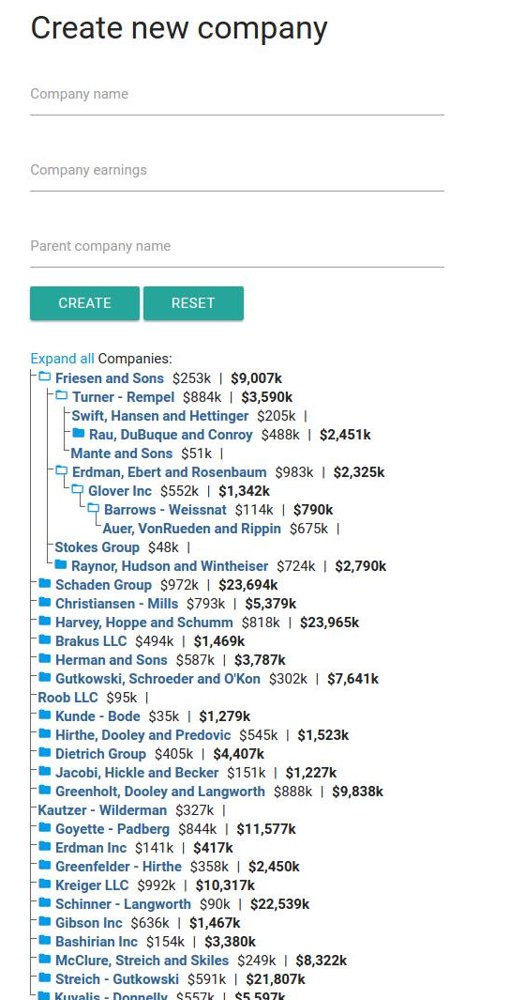

# RiotJs Tree Demon

Used here:

- Mongoose
- Express
- RiotJs - SPA engine. `app.tag.html` hold app state.
Used "Observer" passed via `opts` to trigger state change.
Triggered usually by "next" event.
I think Rx will shine here much better.
- Materializecss - Buggy material-like lib. Really painful and require JQuery :( but let it be here
- Nprogress - youtube like progress bar
- Axios - funny http request lib

## Motivation

Want to practice with express and riotjs. For this purpose I want to create app that can:

- Create, edit, delete companies.
- Show companies tree
- Fields: Name, estimated earnings, parent company
- Show total earning per each company including childs:

|                    |     |     |
|--------------------|-----|-----|
| `Company 1`        | 10k | 35k |
| `- Company 1_1`    | 5k  | 10k |
| `-- Company 1_1_1` | 5k  |     |
| `- Company 1_2`    | 15k |     |

- Nesting level is not limited
- Companies is not limited
- No pagination

## Run

```bash
## Use node 7, need async/await facilities for init db script
# nvm use 7
# Install npm dependencies
npm run install
# Start mongo instance. For example using docker:
docker run -itd -p 127.0.0.1:27017:27017 --name Mongo -d mongo  
# Export `MONGODB_URI`
export MONGODB_URI=mongodb://localhost:27017/tree-demo
# (Optional). Generate fake data.
npm run init-db
# Start app and go to http://localhost:3000
npm run start
```


